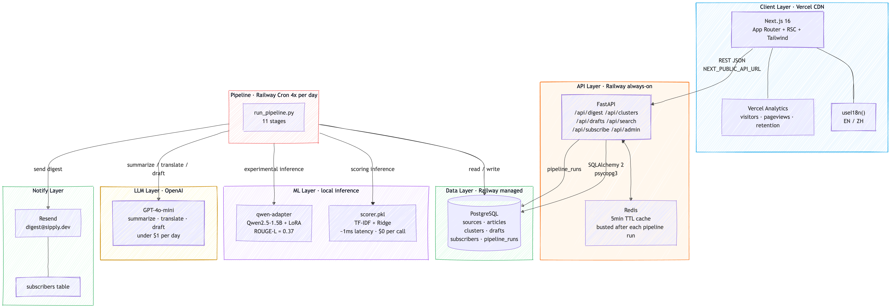
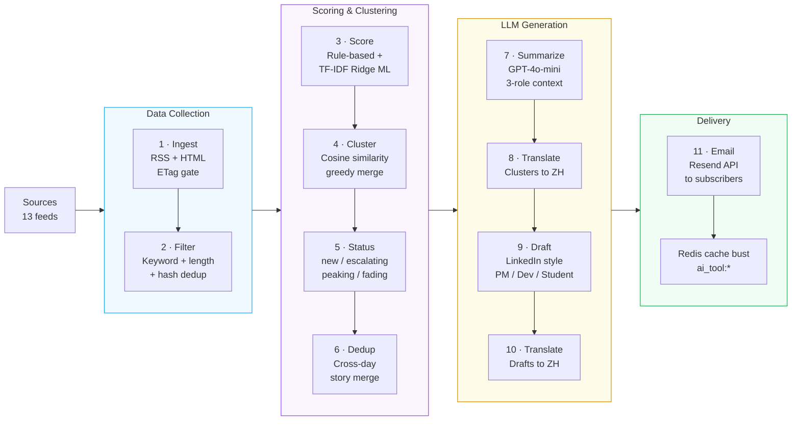

# Sipply — Your Daily AI Intelligence Briefing

> **Sip** your morning news. **Supply** yourself with signal, not noise.

**Problem:** AI professionals lose hours daily sifting 10+ publications to find decision-relevant signal.

**Solution:** A production pipeline that ingests, scores, clusters, and summarises AI news into a role-personalised daily brief — automatically, bilingually, at under $1/day.

- Replaced LLM-based scoring with a trained TF-IDF + Ridge model (422 GPT-labelled examples, Pearson r=0.75), cutting per-run inference cost to $0 while covering 44% of the relevance signal — enabling the system to scale to any volume without API cost growth
- Shipped a complete 11-stage production pipeline (ingest → filter → ML score → cluster → cross-day dedup → summarise → translate → draft → email) running daily on Railway, serving real users a bilingual EN/ZH digest with zero manual intervention
- Fine-tuned Qwen2.5-1.5B via LoRA on 780 knowledge-distilled GPT-4o-mini examples (ROUGE-L = 0.37), validating a path to eliminate LLM API dependency entirely at production scale

**Live demo:** [sipply.dev](https://sipply.dev)

---

## Why I built this

The AI space moves faster than any newsletter can keep up with. I wanted a tool that:
- **Aggregates** every major AI publication automatically
- **Filters** noise from signal with a fast rule-based gate, then ranks by a trained ML scorer
- **Clusters** related stories so you see the thread, not just individual articles
- **Personalises** the angle depending on whether you're a PM, engineer, or student
- **Translates** everything to Chinese for bilingual readers

So I built it — including the ingestion pipeline, the ML scoring model, the LLM processing chain, the REST API, and the frontend.

---

## Features

| | |
|--|--|
| Auto-ingestion | Fetches full article text from 13 sources daily via Railway cron; incremental via HTTP ETag + poll-frequency gate |
| Smart filtering | Rule-based gate (keyword match + length + dedup) removes off-topic articles at zero API cost |
| ML signal scoring | Composite 0-100 score: rule-based dimensions (recency, source authority) + TF-IDF Ridge model predicting audience fit, practical relevance, and novelty |
| Story clustering | TF-IDF + cosine similarity groups related articles into story threads |
| Cross-day dedup | Stories that evolve across days are merged, not duplicated |
| Draft generation | GPT-4o-mini writes a LinkedIn-style newsletter draft for the top story |
| Role personalisation | PM / Developer / Student lenses with tailored "why it matters" context |
| Bilingual | Every field (title, summary, takeaways, draft) auto-translated to Chinese |
| Email digest | Daily digest sent to subscribers via Resend; subscribe bar on homepage |
| Topic filter | Client-side tag filter on homepage; preferences saved to localStorage |
| Social sharing | One-click LinkedIn and X/Twitter share from any draft page |
| Dark / light mode | Theme toggle with localStorage persistence; all colours via CSS custom properties |
| Recency ranking | Digest ranks stories by `score × e^(-0.15 × age_days)` — fresh beats stale |
| Full-text search | Archive search across all clusters and articles |
| SEO / Open Graph | Per-page `<title>` and `og:` tags for cluster and draft pages |

---

## Architecture



The backend is **stateless**. All state lives in PostgreSQL. Redis caches hot endpoints (5-min TTL) and is busted after each successful pipeline run.

## Pipeline



Each stage is a standalone script in `backend/scripts/`; `run_pipeline.py` orchestrates them in sequence with per-stage timing, failure isolation, and a final Redis cache bust.

---

## Tech stack

| Layer | Choice | Why |
|-------|--------|-----|
| Frontend | Next.js 16, TypeScript, Tailwind CSS | App Router, RSC, fast builds |
| Backend | FastAPI, SQLAlchemy 2, Alembic, psycopg3 | Async-ready, typed, proper migrations |
| Database | PostgreSQL | Relational + full-text search |
| Cache | Redis | Simple TTL cache; graceful fallback if unavailable |
| ML scoring | scikit-learn (TF-IDF + Ridge) | Predicts 3 relevance dimensions; trained on 422 GPT-labeled examples |
| LLM fine-tune | Qwen2.5-1.5B + LoRA | Fine-tuned on 780 summarization examples; ROUGE-L=0.37 vs GPT-4o-mini |
| AI | OpenAI GPT-4o-mini | summarise · translate · draft (cluster-level only) |
| Email | Resend | Transactional digest delivery to subscribers |
| Deployment | Vercel + Railway | Frontend CDN + managed Postgres/Redis/cron |
| i18n | Custom `useI18n()` hook | Zero-dependency EN/ZH with type-safe translation keys |

---

## ML scoring model

Three dimensions of the signal score were previously hardcoded at 3.0. They are now predicted by a trained TF-IDF + Ridge Regression model, covering **44% of total score weight**.

### Training pipeline

```
422 articles (production DB)
    → GPT-4o-mini labels audience_fit / practical_relevance / novelty (1-5)
    → TF-IDF (unigrams + bigrams, 30k features) + Ridge Regression
    → 5-fold cross-validation
    → models/scorer.pkl
```

### Evaluation (5-fold CV on 422 labeled examples)

| Dimension | Pearson r | MAE | vs. mean baseline |
|-----------|-----------|-----|-------------------|
| audience_fit | 0.75 | 0.71 | +40% |
| practical_relevance | 0.69 | 0.73 | +32% |
| novelty | 0.71 | 0.62 | +36% |

### Inference

Inference runs in ~1ms locally (vs ~1s for an LLM call) at zero marginal cost. Falls back to `3.0` defaults if `models/scorer.pkl` is not present, so deploys are always safe.

### Retrain

```bash
# 1. Re-label articles (run from backend/)
python -m scripts.label_for_training --output data/labels.jsonl --limit 600

# 2. Retrain and evaluate
python -m scripts.train_scorer --labels data/labels.jsonl --output models/scorer.pkl
```

---

## LLM fine-tune (Qwen2.5-1.5B + LoRA)

A Qwen2.5-1.5B-Instruct model fine-tuned on Sipply's summarization task as an experimental alternative to GPT-4o-mini for article and cluster summarization.

### Training

```
780 examples (422 article + 358 cluster summarization pairs)
    → GPT-4o-mini outputs used as training labels
    → LoRA fine-tune (r=16) on Google Colab T4 GPU (free tier)
    → ~56 minutes training time, 2 epochs
    → models/qwen-adapter/
```

### Results

| Metric | Score |
|--------|-------|
| ROUGE-1 | 0.505 |
| ROUGE-2 | 0.227 |
| ROUGE-L | 0.366 |

Evaluated on 156 held-out examples against GPT-4o-mini outputs as reference.

### Retrain

```bash
# Export training data from DB
python -m scripts.export_finetune_data --output-dir data/

# Run finetune_qwen.ipynb in Google Colab (T4 GPU, free tier)
# Adapter saved to models/qwen-adapter/
```

---

## Data sources

| Source | Type | Cadence |
|--------|------|---------|
| Anthropic Newsroom | HTML scrape | every 60 min |
| OpenAI News | RSS | every 60 min |
| Google DeepMind Blog | HTML scrape | every 120 min |
| Hugging Face Blog | RSS | every 60 min |
| arXiv cs.AI + cs.LG | RSS | daily |
| The Verge AI | RSS | every 30 min |
| Ars Technica AI | RSS | every 60 min |
| TechCrunch AI | RSS | every 30 min |
| VentureBeat AI | RSS | every 30 min |
| AI News | RSS | every 60 min |
| The Register AI | RSS | every 60 min |
| Import AI (newsletter) | RSS | daily |
| TLDR AI (newsletter) | RSS | daily |

---

## Project layout

```
├── app/                    Next.js pages (digest, cluster, draft, archive, admin)
├── components/             UI components (digest cards, cluster view, draft view...)
├── lib/
│   ├── api/                Type-safe backend API client
│   ├── i18n/               EN/ZH locale strings with typed keys
│   └── data/               Static content (AI Basics daily rotation)
├── types/                  Shared TypeScript type definitions
├── middleware.ts           Next.js middleware — admin route guard
└── backend/
    ├── app/
    │   ├── adapters/       Per-source scrapers (RSS, HTML, arXiv, OpenAI, DeepMind...)
    │   ├── api/routes/     FastAPI route handlers
    │   ├── crud/           DB query helpers
    │   ├── models/         SQLAlchemy ORM models
    │   ├── services/       Pipeline business logic (ingest, cluster, summarise...)
    │   └── source_catalog/ trusted_sources.yaml — add new sources here
    ├── data/               Training data (labels.jsonl, finetune_train/eval.jsonl)
    ├── models/             Trained artifacts (scorer.pkl, qwen-adapter/)
    ├── migrations/         Alembic migration history
    └── scripts/            Pipeline stage scripts + ML training scripts
```

---

## Local development

### Frontend

```bash
npm install
npm run dev          # http://localhost:3000
```

Create `.env.local`:
```
NEXT_PUBLIC_API_URL=http://localhost:8000
```

### Backend

```bash
cd backend/
python -m venv .venv && source .venv/bin/activate
pip install -r requirements.txt
cp .env.example .env   # fill in DATABASE_URL + OPENAI_API_KEY
alembic upgrade head
uvicorn app.main:app --reload   # http://localhost:8000
```

### Run the pipeline manually

```bash
cd backend/

# All stages at once
python -m scripts.run_pipeline --triggered-by manual

# Or stage by stage
python -m scripts.ingest_full_articles --slug anthropic-newsroom --per-source-limit 5
python -m scripts.filter_articles
python -m scripts.score_articles
python -m scripts.cluster_articles
python -m scripts.summarize
python -m scripts.generate_draft
```

---

## Deployment

### Backend (Railway)

Deployed as two Railway services sharing one Postgres + Redis instance:

| Service | Config | Schedule |
|---------|--------|----------|
| `personal-ai-intelligence-tool` | `railway.toml` | Always-on API |
| `daily-pipeline-cron` | `railway.cron.toml` | 02:00 UTC daily |

On startup, `alembic upgrade head` runs in a background thread so Railway's healthcheck passes immediately.

Required environment variables:

| Variable | Purpose |
|----------|---------|
| `DATABASE_URL` | PostgreSQL connection string (`postgresql+psycopg://...`) |
| `OPENAI_API_KEY` | GPT-4o-mini — summarise, translate, draft |
| `RESEND_API_KEY` | Email delivery for daily digest |
| `REDIS_URL` | Auto-set by Railway Redis plugin |
| `JWT_SECRET` | Signs admin JWT tokens |
| `ADMIN_USERNAME` / `ADMIN_PASSWORD` / `ADMIN_SECRET` | Admin login |

### Frontend (Vercel)

Auto-deploys from GitHub. Set one environment variable:

```
NEXT_PUBLIC_API_URL=https://your-backend.up.railway.app
```

---

## API highlights

```bash
# Today's digest (featured story + top clusters + draft)
GET /api/digest/today

# All clusters (paginated, ranked by recency-weighted score)
GET /api/clusters?limit=20&offset=0

# Single cluster with source articles + related stories
GET /api/clusters/{id}

# Role-personalised draft
GET /api/drafts/{id}?role=pm          # PM lens
GET /api/drafts/{id}?role=developer   # Engineer lens
GET /api/drafts/{id}?role=student     # Student / job-seeker lens

# Full-text search
GET /api/search?q=GPT-5&type=cluster

# Subscribe to email digest
POST /api/subscribe   { "email": "..." }

# Interactive docs
GET /docs
```

---

## Design decisions worth noting

**Why not vector search for clustering?**
TF-IDF + cosine similarity runs locally with no API calls, adds zero cost per run, and works well on the short article excerpts we ingest. Vector embeddings would improve recall across semantically similar but lexically different articles — a natural next upgrade.

**Why GPT-4o-mini instead of a larger model?**
The pipeline runs daily across 13 sources. Filtering and scoring are handled by rule-based logic and a local ML model (zero API cost). GPT-4o-mini is only used for summarisation, translation, and draft generation — keeping total cost under $1/day.

**Why Redis cache with 5-min TTL?**
The digest and cluster list endpoints are hit on every page load. Caching avoids repeated Postgres aggregation queries. The pipeline explicitly busts the cache (`ai_tool:*`) after every successful run so stale data never persists beyond one cycle.

**Why incremental RSS ingestion?**
Each source has a configurable `fetch_frequency_minutes`. The ingest script skips sources polled too recently (`last_polled_at` gate) and sends `If-None-Match` ETag headers so unchanged feeds return HTTP 304 with zero parsing cost — saving bandwidth and avoiding source rate limits.
